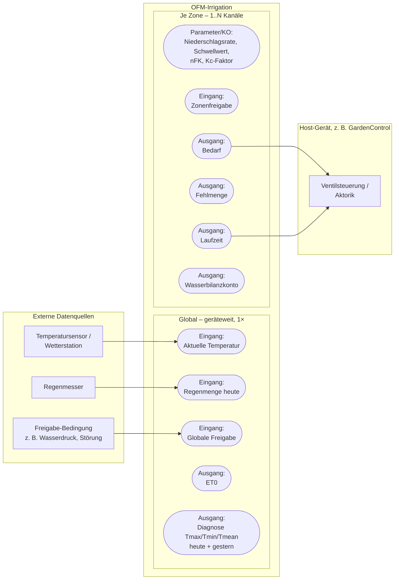

# OFM-Irrigation – Schnittstellenübersicht

Dieses Dokument beschreibt die **Ein- und Ausgänge** des geplanten, eigenständigen
OpenKNX-Moduls `OFM-Irrigation`. Es enthält bewusst **keine** Formeln oder
Herleitungen – dafür siehe `Bewaesserung-Wasserbilanz.md`. Hier geht es nur um
die Schnittstelle: was muss von außen reinkommen, was gibt das Modul heraus,
und was bleibt bewusst außerhalb des Moduls.

## Architekturprinzip

`OFM-Irrigation` rechnet ausschließlich die Wasserbilanz. Es schaltet **kein**
Ventil selbst. Stattdessen gibt es "Bedarf" und "Laufzeit" als KO aus – das
konsumierende Gerät (z. B. `GardenControl`) liest diese Werte und steuert damit
seine eigene, hardwarespezifische Aktorik. Diese Trennung ist der Grund, warum
das Modul überhaupt geräteübergreifend wiederverwendbar wird.

Zwei Ebenen, analog zur bisherigen Umsetzung in GardenControl:

- **Global (geräteweit, einmalig)**: Wetterdaten, ET0-Berechnung.
- **Je Zone (1..N Kanäle)**: Zonenparameter und Wasserbilanz-Ergebnisse.

## Blockschaltbild

## Global: geräteweite Ein-/Ausgänge

Genau einmal pro Gerät, unabhängig von der Anzahl der Zonen.

| Richtung | Objekt | DPT | Bedeutung |
|---|---|---|---|
| Eingang | Aktuelle Temperatur | 9.001 | Laufender Temperaturwert; Modul bildet daraus Tmax/Tmin/Tmean des Tages |
| Eingang | Regenmenge heute | 9.026 | Bereits aufsummierter Tages-Niederschlag in mm |
| Eingang | Globale Freigabe | 1.001 | Geräteweite Sicherheitsbedingung (Wasserdruck, Störung, Anlagensperre) |
| Ausgang | ET0 | 9.026 | Berechnete Referenz-Evapotranspiration des abgelaufenen Tages, mm/Tag |
| Ausgang | Durchschnittstemperatur heute / gestern | 9.001 | Diagnose |
| Ausgang | Temperatur max/min heute / gestern | 9.001 | Diagnose |

## Je Zone: Ein-/Ausgänge (1..N Kanäle)

Pro Zone unabhängig konfigurier- und auswertbar.

| Richtung | Objekt | DPT | Bedeutung |
|---|---|---|---|
| Parameter (optional per KO) | Niederschlagsrate | – / 9.001 | Hydraulische Ausbringrate der Zone, mm/h |
| Parameter (optional per KO) | Schwellwert | – / 5.001 | Anteil der nFK, ab dem bewässert wird, % |
| Parameter (optional per KO) | nFK | – / 9.001 | Nutzbare Feldkapazität der Zone, mm |
| Parameter (optional per KO) | Kc-Faktor | – / 9.001 | Kulturfaktor der Zone |
| Eingang | Zonenfreigabe | 1.001 | Zusätzliche, nur für diese Zone geltende Freigabe |
| Ausgang | Bedarf | 1.001 | Bewässerung für diese Zone nötig? |
| Ausgang | Fehlmenge | 9.026 | Fehlende Wassermenge bis zur vollen nFK, mm |
| Ausgang | Laufzeit | 7.005 | Berechnete Ventil-Öffnungsdauer, s |
| Ausgang | Wasserbilanzkonto | 9.026 | Aktueller Kontostand des Bodenwasserspeichers, mm |

## Bewusst außerhalb des Moduls

- **Ventilsteuerung/Aktorik** – liegt beim Host-Gerät. `OFM-Irrigation` liefert nur Bedarf + Laufzeit.
- **Rückbuchung nach der Bewässerung** – wird durch auslesen des Status automatisch durchgeführt.
- **Regenmesser-Hardware, Temperatursensor-Hardware** – reine Zulieferer der beiden globalen Eingänge, keine Kenntnis im Modul nötig.

